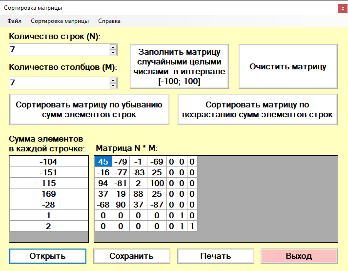

# "Сортировка матрицы"

## Технологии разработки

Программа разработана на языке C# с использованием Windows Forms.

## Запуск

Для запуска игры используется исполняемый файл `Matrix.exe`.

## Возможности программы

Программа обеспечивает:

- ввод количества строк в матрице `n <= 100` и количества столбцов в матрице `m <= 100`;
- ввод элементов матрицы с клавиатуры или случайным образом в интервале `[-100; 100]`;
- контроль ввода элементов матрицы при ручном вводе;
- ввод из текстового файла специального формата (данные идут через пробел, каждая новая строка матрицы с новой строки файла);
- сортировку строк матрицы по выбору:
  - по убыванию сумм элементов строк;
  - по возрастанию сумм элементов строк.
- вывод результатов на экран, а по желанию пользователя на принтер или в текстовый файл;
- вывод на экран хранящейся в файле матрицы, её корректировки и повторной записи в файл;
- вывод справки об авторе и программе

Пример файла с матрицей лежит в корне репозитория - `matrix.txt`.

## Вид программы

